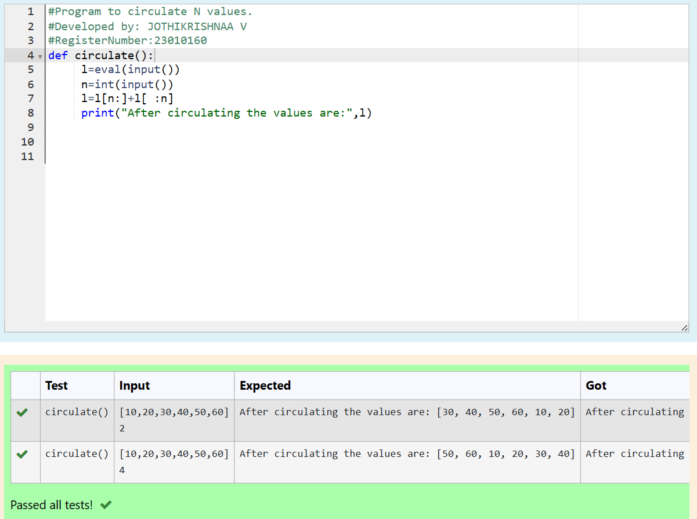

# Circulate-the-values-of-N-variables
## Aim:
To write a python program to circulate the n variables using function concept
## Equipment’s required:
PC
Anaconda - Python 3.7
## Algorithm: 
### Step 1: 
Define a function name it as circulate
### Step 2: 
Assign the variables
### Step 3: 
Get the value from the user for the number of rotation
### Step 4: 
Using the slicing concept rotate the list
### Step 5: 
Print the rotated list
### Step 6: 
End the program
## Program:
## Program to circulate N values.
## Developed by: JOTHIKRISHNAA V
## RegisterNumber:23010160
~~~
def circulate():
     l=eval(input())
     n=int(input())
     l=l[n:]+l[ :n]
     print("After circulating the values are:",l)
~~~
## Output:

## Result:
Thus the circulating of n-values are successfully executed
